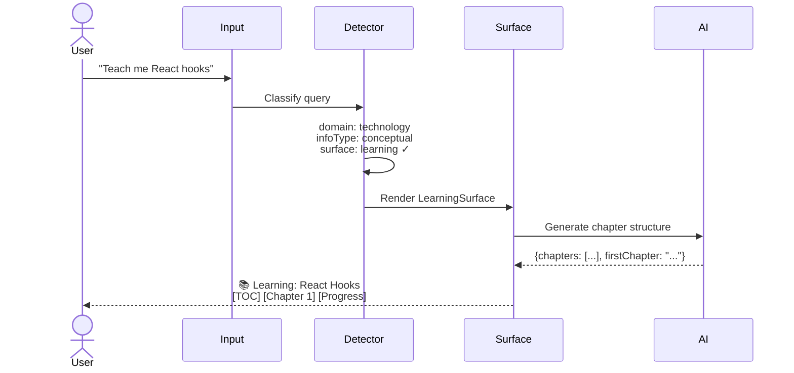
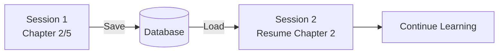
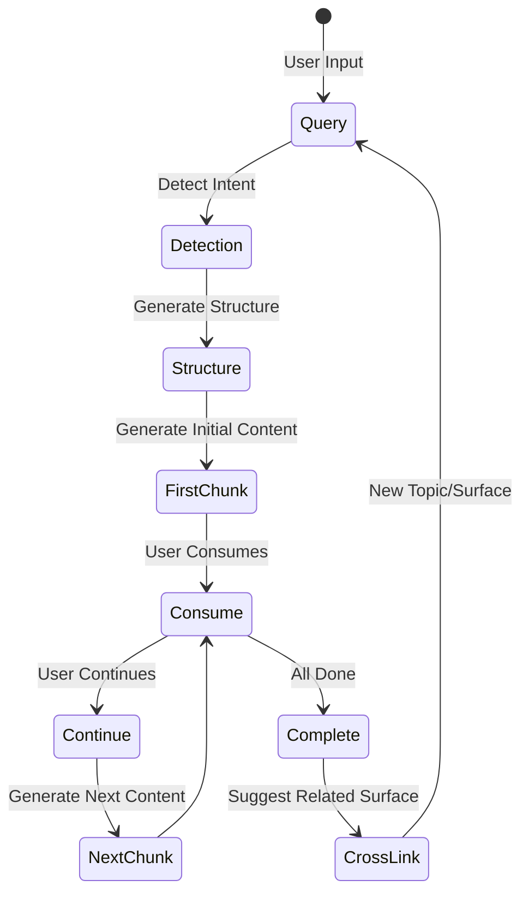
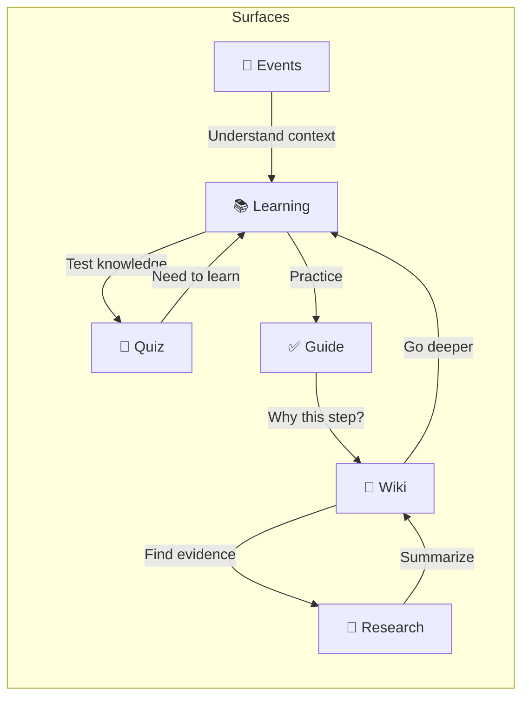

# Rethinking Rynk: From AI Chat to Adaptive Deep Work Interface

## Executive Summary

**Vision**: Transform Rynk from an AI chat application into an **adaptive AI workspace** that morphs its interface based on user intent, enabling deep work across learning, research, professional tasks, and creative endeavors.

---

## Part 1: Current State Analysis

### What We Have

```mermaid
flowchart TB
    subgraph Current["Current Architecture"]
        direction TB
        UI[Uniform Chat UI]
        DT[domain-types.ts<br/>10 domains, 10 info types]
        RD[reasoning-detector.ts<br/>Query Classification]
        DF[domain-formatter.ts<br/>Response Formatting]
        
        UI --> DT --> RD --> DF --> UI
    end
    
    style Current fill:#1e1e2e,stroke:#6c7086
    style UI fill:#313244,stroke:#89b4fa
```



#### Existing Domain Classification
From [domain-types.ts](file:///Users/farseen/Documents/projects/simplychat/lib/services/domain-types.ts):

| Domain | Sub-domains | Information Types |
|--------|------------|-------------------|
| science | physics, chemistry, biology, math, engineering | factual, conceptual, procedural |
| medicine | general, surgery, pharmacy, nursing | factual, diagnostic |
| business | finance, accounting, marketing, management | analytical, market_data |
| technology | web_dev, mobile, AI/ML, cybersecurity | procedural, diagnostic |
| law | constitutional, criminal, civil, corporate | conceptual, analytical |
| journalism | news, investigative, data journalism | current_events |
| arts | literature, history, philosophy, music | creative, conceptual |
| design | architecture, UX/UI, product design | creative, procedural |
| social | sociology, psychology, education | conceptual, research |
| environment | climate, energy, agriculture | factual, research |

#### Current Response Requirements
```typescript
interface ResponseRequirements {
  needsDiagrams: boolean      // Visual representations
  needsRealTimeData: boolean  // Live data fetching
  needsCitations: boolean     // Academic/professional citations
  needsStepByStep: boolean    // Procedural formatting
  needsDisclaimer: boolean    // Legal/medical disclaimers
  needsComparison: boolean    // A vs B analysis
  needsCode: boolean          // Code examples
}
```

### The Gap

> **The system already knows WHAT the user needs. It just doesn't show it differently.**

Current flow:
1. User asks → Query classified → Response formatted → **Same chat bubble UI**

Proposed flow:
1. User asks → Query classified → **UI morphs** → Response rendered in appropriate interface

---

## Part 2: Intent-Based UI Modes

### Core Concept: "Surfaces"

Instead of one chat interface, Rynk renders different **surfaces** based on detected intent:

```mermaid
flowchart LR
    Query[User Query] --> Detector[Intent Detector]
    Detector --> Surface{Which Surface?}
    
    Surface --> |learning| Learn[📚 Learning Surface]
    Surface --> |guide| Guide[✅ Guide Surface]
    Surface --> |research| Research[🔬 Research Surface]
    Surface --> |wiki| Wiki[📖 Wiki Surface]
    Surface --> |quiz| Quiz[🎯 Quiz Surface]
    Surface --> |events| Events[📰 Events Surface]
    Surface --> |professional| Pro[💼 Professional Surface]
    Surface --> |creative| Creative[✨ Creative Surface]
    Surface --> |default| Chat[💬 Chat Surface]
    
    style Surface fill:#313244,stroke:#89b4fa
```



### Surface Definitions

#### 1. 📚 Learning Surface
**Trigger**: "Explain X", "Teach me about", "I want to understand", conceptual queries about complex topics

**UI Components**:
- **Table of Contents** (left panel) - AI generates topic structure
- **Chapter View** (main) - Current section being explained
- **Progress Bar** - Track learning journey
- **Depth Selector** - Basic / Intermediate / Advanced / Expert
- **Related Topics** - Suggested next chapters
- **Notes Panel** - User can take notes, highlighting

```
┌─────────────────────────────────────────────────────────┐
│ 📚 Learning: Quantum Computing                          │
├──────────┬──────────────────────────────────────────────┤
│ Contents │                                              │
│          │  Chapter 2: Qubits                           │
│ □ Intro  │  ═══════════════════════════                 │
│ ▣ Qubits │                                              │
│ □ Gates  │  Unlike classical bits that can be 0 or 1,  │
│ □ Entang │  qubits exist in superposition...           │
│ □ Algori │                                              │
│          │  [Visual: Bloch Sphere Diagram]             │
│          │                                              │
│ ──────── │  ▶ Continue to Chapter 3                    │
│ Progress │                                              │
│ [██░░░░] │                                              │
└──────────┴──────────────────────────────────────────────┘
```

#### 2. ✅ Guide Surface  
**Trigger**: "How do I", "Steps to", "Guide me through", procedural queries

**UI Components**:
- **Todo List** with checkable steps
- **Current Step Expanded** with details
- **Estimated Time** per step
- **Dependencies** (what needs to be done first)
- **Completion Tracking** - Resume where you left off

```
┌─────────────────────────────────────────────────────────┐
│ ✅ Guide: Setting Up a Next.js Project with Tailwind    │
│    ⏱️ ~15 min • 6 steps remaining                       │
├─────────────────────────────────────────────────────────┤
│                                                         │
│ ☑ Step 1: Prerequisites (Node.js v18+)         ~1 min  │
│ ☑ Step 2: Create Next.js app                   ~2 min  │
│ ▶ Step 3: Install Tailwind CSS                 ~3 min  │
│   ├─ Run: npm install -D tailwindcss postcss autopref  │
│   ├─ Run: npx tailwindcss init -p                      │
│   └─ Configure tailwind.config.js                      │
│     [Copy: content: ["./src/**/*.{js,ts,jsx,tsx}"] ]   │
│                                                         │
│ ○ Step 4: Configure CSS                        ~2 min  │
│ ○ Step 5: Test setup                           ~2 min  │
│ ○ Step 6: First component                      ~5 min  │
│                                                         │
│ [Mark Step 3 Complete] [Skip] [Ask Question About Step]│
└─────────────────────────────────────────────────────────┘
```

#### 3. 🔬 Research Surface
**Trigger**: Research queries, academic exploration, deep analysis requests

**UI Components**:
- **Thesis/Claim** at top
- **Evidence Cards** from multiple sources
- **Source Quality Indicators** (peer-reviewed, official, etc.)
- **Contradiction Alerts** when sources disagree
- **Citation Export** (APA, MLA, etc.)
- **Research Trail** - History of exploration

```
┌─────────────────────────────────────────────────────────┐
│ 🔬 Research: Effects of Intermittent Fasting            │
├─────────────────────────────────────────────────────────┤
│ Thesis: Intermittent fasting shows promising results    │
│         for metabolic health with mixed evidence on...  │
├─────────────────────────────────────────────────────────┤
│ Evidence For                 │ Evidence Against         │
│ ┌─────────────────────────┐  │ ┌─────────────────────┐ │
│ │ 📄 NEJM Study 2019      │  │ │ 📄 JAMA Review 2020 │ │
│ │ ★★★★★ Peer Reviewed     │  │ │ ★★★★☆ Meta-analysis │ │
│ │ "16:8 fasting reduced   │  │ │ "No significant     │ │
│ │ insulin resistance..." │  │ │ weight loss vs..."  │ │
│ └─────────────────────────┘  │ └─────────────────────┘ │
│                               │                         │
│ ⚠️ Conflicting: Weight loss claims vary significantly   │
├─────────────────────────────────────────────────────────┤
│ [Export Citations] [Dig Deeper] [Save to Library]       │
└─────────────────────────────────────────────────────────┘
```

#### 4. 📖 Wiki Surface
**Trigger**: "What is X", fact-based queries, definitions, encyclopedic lookups

**UI Components**:
- **Hero Section** with key facts
- **Infobox** (sidebar with quick data)
- **Structured Sections** (Overview, History, etc.)
- **Internal Links** to related topics
- **References** at bottom

```
┌─────────────────────────────────────────────────────────┐
│ 📖 Mitochondria                                         │
├─────────────────────────────┬───────────────────────────┤
│                             │ ┌───────────────────────┐ │
│ The mitochondrion is a      │ │ Quick Facts           │ │
│ membrane-bound organelle    │ │ ───────────────────── │ │
│ found in the cytoplasm of   │ │ Size: 0.5-10 μm      │ │
│ eukaryotic cells.           │ │ DNA: Circular mtDNA   │ │
│                             │ │ Discovered: 1857      │ │
│ [Image: Mitochondria]       │ │ Function: ATP prod.   │ │
│                             │ └───────────────────────┘ │
│ ─────────────────────────── │                           │
│ § Structure                 │ Related Topics           │
│ § Function                  │ • Cell Biology           │
│ § ATP Production            │ • Cellular Respiration   │
│ § Disease & Disorders       │ • Organelles             │
│ § Research                  │                           │
└─────────────────────────────┴───────────────────────────┘
```

#### 5. 🎯 Quiz Surface
**Trigger**: "Quiz me on", "Test my knowledge", learning assessment requests

**UI Components**:
- **Question Card** with multiple choice or open-ended
- **Progress Indicator** (Question 3/10)
- **Immediate Feedback** with explanations
- **Score Summary** at end
- **Weak Areas** - Suggest topics to review

```
┌─────────────────────────────────────────────────────────┐
│ 🎯 Quiz: JavaScript Fundamentals     Question 3 of 10   │
│    [████████░░░░░░░░░░░░] 30%                           │
├─────────────────────────────────────────────────────────┤
│                                                         │
│ What is the output of the following code?               │
│                                                         │
│ ```javascript                                           │
│ console.log(typeof null);                               │
│ ```                                                     │
│                                                         │
│ ○ A) "null"                                             │
│ ○ B) "undefined"                                        │
│ ● C) "object"         ✓ Correct!                       │
│ ○ D) "boolean"                                          │
│                                                         │
│ 💡 Explanation: This is a known JavaScript bug that     │
│    has persisted since the first version. typeof null   │
│    returns "object" due to how types were represented.  │
│                                                         │
│                               [Next Question →]         │
└─────────────────────────────────────────────────────────┘
```

#### 6. 📰 Events Surface
**Trigger**: "What happened with", current events, news queries, market updates

**UI Components**:
- **Timeline View** of events
- **Source Cards** (news articles, videos, official statements)
- **Credibility Indicators**
- **Multiple Perspectives** when applicable
- **Live Updates** indicator

```
┌─────────────────────────────────────────────────────────┐
│ 📰 Events: OpenAI DevDay 2024         🔴 Recent (2d)    │
├─────────────────────────────────────────────────────────┤
│ Timeline                                                │
│ ────────●───────────●──────────────●────────────→       │
│      Keynote    API Updates    Sora Demo                │
│                                                         │
│ Key Announcements                                       │
│ ┌──────────────┐ ┌──────────────┐ ┌──────────────┐     │
│ │ 🎬 Sora       │ │ 🔧 API v2    │ │ 💬 Realtime  │     │
│ │ Video gen.   │ │ 50% cheaper  │ │ Voice API    │     │
│ │ model        │ │ 2x faster    │ │ released     │     │
│ └──────────────┘ └──────────────┘ └──────────────┘     │
│                                                         │
│ Sources (12)                                            │
│ 📺 YouTube: OpenAI Official    ★★★★★                   │
│ 📰 The Verge: DevDay Coverage  ★★★★☆                   │
│ 📰 TechCrunch: Analysis        ★★★★☆                   │
└─────────────────────────────────────────────────────────┘
```

#### 7. 💼 Professional Surface
**Trigger**: Business queries, analysis requests, strategy planning

**UI Components**:
- **Executive Summary** box
- **Data Visualizations** (charts, graphs)
- **SWOT/Framework Cards** when applicable
- **Action Items** extracted
- **Export Options** (PDF, Slides)

#### 8. ✨ Creative Surface
**Trigger**: Writing requests, brainstorming, ideation

**UI Components**:
- **Canvas View** (freeform ideation)
- **Variations** (multiple options to choose from)
- **Version History** 
- **Style Controls** (tone, length, format)
- **Export** (Markdown, Doc)

---

## Part 3: Technical Architecture

### New Type System

Extend [domain-types.ts](file:///Users/farseen/Documents/projects/simplychat/lib/services/domain-types.ts):

```typescript
// New: Surface Type Definition
export type SurfaceType = 
  | 'learning'      // 📚 Table of contents, chapters, progress
  | 'guide'         // ✅ Step-by-step todos with completion
  | 'research'      // 🔬 Evidence cards, citations, sources
  | 'wiki'          // 📖 Wikipedia-style structured info
  | 'quiz'          // 🎯 Interactive Q&A with scoring
  | 'events'        // 📰 Timeline, news cards, live updates
  | 'professional'  // 💼 Executive summary, data viz
  | 'creative'      // ✨ Canvas, variations, versioning
  | 'chat'          // 💬 Default conversational

// Surface detection result
export interface SurfaceDetection extends EnhancedDetectionResult {
  surface: SurfaceType
  surfaceConfidence: number
  surfaceMetadata: SurfaceMetadata
}

// Metadata varies by surface type
export type SurfaceMetadata = 
  | LearningMetadata
  | GuideMetadata
  | ResearchMetadata
  | WikiMetadata
  | QuizMetadata
  | EventsMetadata
  | ProfessionalMetadata
  | CreativeMetadata
  | ChatMetadata

interface LearningMetadata {
  suggestedChapters: { title: string; description: string }[]
  estimatedDepth: 'basic' | 'intermediate' | 'advanced' | 'expert'
  prerequisites: string[]
}

interface GuideMetadata {
  estimatedSteps: number
  estimatedTime: number // minutes
  difficulty: 'beginner' | 'intermediate' | 'advanced'
  category: string // setup, troubleshooting, workflow, etc.
}

interface ResearchMetadata {
  suggestedQueries: string[]
  requiredSourceTypes: ('academic' | 'news' | 'official' | 'community')[]
  controversyLevel: 'none' | 'low' | 'medium' | 'high'
}
```

### Component Architecture

```mermaid
flowchart TB
    subgraph Pages["Chat/Project/Guest Pages"]
        CP[ChatPage]
    end
    
    subgraph Surfaces["Surface Components"]
        SF[SurfaceFactory]
        SF --> LS[LearningSurface]
        SF --> GS[GuideSurface]
        SF --> RS[ResearchSurface]
        SF --> WS[WikiSurface]
        SF --> QS[QuizSurface]
        SF --> ES[EventsSurface]
        SF --> PS[ProfessionalSurface]
        SF --> CS[CreativeSurface]
        SF --> ChatS[ChatSurface<br/>(current UI)]
    end
    
    subgraph Shared["Shared Components"]
        TOC[TableOfContents]
        Steps[StepList]
        Cards[EvidenceCards]
        Timeline[Timeline]
        Quiz[QuizCard]
    end
    
    CP --> SF
    LS --> TOC
    GS --> Steps
    RS --> Cards
    ES --> Timeline
    QS --> Quiz
```

### Database Extension

Add to [schema.sql](file:///Users/farseen/Documents/projects/simplychat/schema.sql):

```sql
-- Track surface state for conversations
ALTER TABLE conversations ADD COLUMN surface_type TEXT DEFAULT 'chat';
ALTER TABLE conversations ADD COLUMN surface_state TEXT; -- JSON for progress, etc.

-- Surface-specific data
CREATE TABLE learning_progress (
  id TEXT PRIMARY KEY,
  conversationId TEXT NOT NULL,
  userId TEXT NOT NULL,
  currentChapter INTEGER DEFAULT 0,
  completedChapters TEXT, -- JSON array
  notes TEXT, -- JSON array
  createdAt DATETIME DEFAULT CURRENT_TIMESTAMP,
  updatedAt DATETIME DEFAULT CURRENT_TIMESTAMP,
  FOREIGN KEY (conversationId) REFERENCES conversations(id) ON DELETE CASCADE
);

CREATE TABLE guide_progress (
  id TEXT PRIMARY KEY,
  conversationId TEXT NOT NULL,
  completedSteps TEXT, -- JSON array of step indices
  skippedSteps TEXT,
  createdAt DATETIME DEFAULT CURRENT_TIMESTAMP,
  updatedAt DATETIME DEFAULT CURRENT_TIMESTAMP,
  FOREIGN KEY (conversationId) REFERENCES conversations(id) ON DELETE CASCADE
);
```

---

## Part 4: User Experience Flows

### Flow 1: Natural Surface Detection



### Flow 2: Surface Switching

Users can:
1. **Manually switch** - "Show this as a guide instead"
2. **AI suggests** - "Would you like me to create a quiz on this topic?"
3. **Persist preference** - Remember user's preferred surfaces for topics

### Flow 3: Continuation & Persistence



---

## Part 5: Implementation Phases

### Phase 1: Foundation (2-3 weeks)
- [ ] Extend `domain-types.ts` with Surface types
- [ ] Create `surface-detector.ts` service
- [ ] Build `SurfaceFactory` component
- [ ] Implement `ChatSurface` (refactored current UI)
- [ ] Add surface_type to conversations table

### Phase 2: Learning & Guide Surfaces (2-3 weeks)
- [ ] Build `LearningSurface` with TOC, chapters, progress
- [ ] Build `GuideSurface` with steps, completion, timing
- [ ] Implement progress persistence
- [ ] Add surface switching UI

### Phase 3: Research & Wiki Surfaces (2 weeks)
- [ ] Build `ResearchSurface` with evidence cards, citations
- [ ] Build `WikiSurface` with infobox, structured sections
- [ ] Integrate with existing search pipeline

### Phase 4: Interactive Surfaces (2 weeks)
- [ ] Build `QuizSurface` with question cards, scoring
- [ ] Build `EventsSurface` with timeline, source cards
- [ ] Add real-time update capabilities

### Phase 5: Professional & Creative (2 weeks)
- [ ] Build `ProfessionalSurface` with data viz, exports
- [ ] Build `CreativeSurface` with canvas, variations
- [ ] Implement export functionality

### Phase 6: Polish & Intelligence (Ongoing)
- [ ] Surface switching suggestions from AI
- [ ] User preference learning
- [ ] Cross-surface linking (learning → quiz, etc.)
- [ ] Mobile-optimized surface views

---

## Part 6: Key Differentiators

| Feature | Current Chat Apps | Rynk with Surfaces |
|---------|-------------------|-------------------|
| Learning | Long scrolling chat | Structured chapters with progress |
| Guides | Numbered list in chat | Interactive todo with completion |
| Research | Citations in text | Evidence cards with source quality |
| Quizzes | Q&A in chat | Dedicated quiz UI with scoring |
| News | Text summary | Timeline with source cards |
| Persistence | Scroll to find | Resume exactly where you left off |

---

## Part 7: Open Questions for User

1. **Priority**: Which surfaces should we build first? (Learning + Guide seem highest value)

2. **Surface Detection**: Should surfaces be:
   - Auto-detected (AI decides)
   - User-selected (explicit mode)
   - Suggested (AI proposes, user confirms)
   - Hybrid (auto with easy override)

3. **Existing Conversations**: How should we handle existing chat conversations? 
   - Keep as ChatSurface
   - Offer to "upgrade" to appropriate surface
   - Retroactively detect and transform

4. **Mobile**: Should mobile have simplified surfaces or full feature parity?

5. **Projects**: Should projects have a default surface type? (e.g., a "Learning Project" always uses LearningSurface)

---

## Conclusion

This is not just a UI change—it's a **paradigm shift** from "AI that chats" to "AI that adapts to how you work". The domain detection system already exists; we're extending it to drive the UI, not just the response format.

The key insight: **ChatGPT made everyone use chat. We're making chat fit what people actually need.**

---

## Part 8: Surface Generation & Continuation Mechanics

> **Core Design Principle**: Every surface has a **Generate → Consume → Continue** loop. The user never hits a dead end—there's always a natural next action.

### Universal Generation Model



### Surface-Specific Mechanics

---

#### 📚 Learning Surface

**Initial Generation (on query)**:
```
User: "Teach me about distributed systems"
```

**Phase 1: Structure Generation** (~1-2 seconds)
AI generates a **course outline** first:

```typescript
interface LearningStructure {
  title: string                    // "Distributed Systems"
  description: string              // "A comprehensive guide..."
  estimatedDuration: string        // "2-3 hours"
  depth: 'basic' | 'intermediate' | 'advanced' | 'expert'
  chapters: {
    id: string
    title: string                  // "1. What is a Distributed System?"
    description: string            // "Core concepts and definitions"
    estimatedTime: number          // 15 (minutes)
    status: 'locked' | 'available' | 'in-progress' | 'completed'
    subSections?: string[]         // Optional sub-sections
  }[]
  prerequisites: string[]          // What user should know first
}
```

**Phase 2: First Chapter Generation**
Once structure is shown, AI immediately generates Chapter 1:

```
┌─────────────────────────────────────────────────────────────┐
│ 📚 Learning: Distributed Systems           Depth: Advanced │
│    ⏱️ ~2-3 hours • 8 chapters                               │
├────────────┬────────────────────────────────────────────────┤
│  CHAPTERS  │                                                │
│            │  Chapter 1: What is a Distributed System?      │
│ ● Ch 1 ◄── │  ═══════════════════════════════════════════   │
│ ○ Ch 2     │                                                │
│ ○ Ch 3     │  A distributed system is a collection of       │
│ ○ Ch 4     │  independent computers that appear to users    │
│ ○ Ch 5     │  as a single coherent system...                │
│ ○ Ch 6     │                                                │
│ ○ Ch 7     │  [Diagram: Nodes communicating over network]   │
│ ○ Ch 8     │                                                │
│            │  Key Characteristics:                          │
│ ────────── │  • Concurrency                                 │
│  Progress  │  • No global clock                             │
│  [█░░░░░░] │  • Independent failures                        │
│  12%       │                                                │
├────────────┴────────────────────────────────────────────────┤
│ [✓ Mark Complete] [→ Next Chapter] [? Ask Question] [📝 Note]│
└─────────────────────────────────────────────────────────────┘
```

**Continuation Actions**:

| Action | What Happens |
|--------|-------------|
| **→ Next Chapter** | Generate Chapter 2 content |
| **Click any chapter** | Generate that chapter (jump ahead) |
| **? Ask Question** | Opens inline chat about current chapter |
| **Go Deeper** | AI expands current section with more detail |
| **Simplify** | AI rewrites in simpler terms |
| **📝 Add Note** | User adds personal note, saved to chapter |
| **🎯 Quiz Me** | Switches to Quiz Surface for current chapter |

**Smart Continuation**:
- If user asks a question mid-chapter, AI answers in context
- After answering, suggests: "Continue to next section?" or "Would you like me to add this to the chapter?"
- Tracks what was read vs skimmed (time spent)

---

#### ✅ Guide Surface

**Initial Generation**:
```
User: "How do I deploy a Next.js app to Vercel?"
```

**Phase 1: Quick Steps Overview** (~1 second)
```typescript
interface GuideStructure {
  title: string
  totalSteps: number
  estimatedTime: number           // minutes
  difficulty: 'beginner' | 'intermediate' | 'advanced'
  prerequisites: string[]
  steps: {
    index: number
    title: string                 // "Install Vercel CLI"
    estimatedTime: number
    status: 'pending' | 'in-progress' | 'completed' | 'skipped'
    hasSubsteps: boolean
  }[]
}
```

**Phase 2: Expand Current Step**
Shows all steps collapsed, then expands Step 1 with details:

```
┌─────────────────────────────────────────────────────────────┐
│ ✅ Guide: Deploy Next.js to Vercel        ⏱️ ~10 min total  │
├─────────────────────────────────────────────────────────────┤
│                                                             │
│ ▼ Step 1: Install Vercel CLI (current)             ~2 min  │
│   ┌─────────────────────────────────────────────────────┐   │
│   │ Run this command in your terminal:                  │   │
│   │                                                     │   │
│   │ $ npm install -g vercel                   [Copy]    │   │
│   │                                                     │   │
│   │ ℹ️ This installs the Vercel CLI globally.          │   │
│   │    You only need to do this once.                  │   │
│   │                                                     │   │
│   │ ⚠️ If you get permission errors, try:              │   │
│   │    sudo npm install -g vercel                      │   │
│   └─────────────────────────────────────────────────────┘   │
│                                                             │
│ ▷ Step 2: Login to Vercel                          ~1 min  │
│ ▷ Step 3: Link Project                             ~2 min  │
│ ▷ Step 4: Configure Environment Variables          ~3 min  │
│ ▷ Step 5: Deploy                                   ~2 min  │
│                                                             │
├─────────────────────────────────────────────────────────────┤
│ [✓ Done, Next Step] [Skip Step] [I'm Stuck] [More Detail]   │
└─────────────────────────────────────────────────────────────┘
```

**Continuation Actions**:

| Action | What Happens |
|--------|-------------|
| **✓ Done, Next Step** | Marks complete, generates next step details |
| **Skip Step** | Marks skipped, moves to next |
| **I'm Stuck** | Opens troubleshooting chat for this step |
| **More Detail** | Expands with substeps, explanations, alternatives |
| **Click any step** | Jumps to that step, generates its details |
| **Undo** | Re-open previous step |

**Intelligent Branching**:
If user says "I'm stuck" or asks a question:
- AI answers in context
- If it's a common issue, asks: "Should I add this as a troubleshooting note?"
- If user needs something different: "Would you like to switch to a more detailed guide?"

---

#### 🔬 Research Surface

**Initial Generation**:
```
User: "Research the effectiveness of spaced repetition for learning"
```

**Phase 1: Research Plan** (AI shows what it will search)
```
┌──────────────────────────────────────────────────────────────┐
│ 🔬 Research: Spaced Repetition Effectiveness                 │
├──────────────────────────────────────────────────────────────┤
│ 📋 Research Plan                                             │
│                                                              │
│ I'll search for:                                             │
│ ✓ Academic studies (peer-reviewed journals)                  │
│ ✓ Meta-analyses and systematic reviews                       │
│ ✓ Practical implementation data                              │
│ ○ Expert opinions and counterarguments                       │
│                                                              │
│ Questions to answer:                                         │
│ 1. Does spaced repetition improve long-term retention?       │
│ 2. What is the optimal spacing interval?                     │
│ 3. For what types of learning is it most effective?          │
│ 4. What are the limitations?                                 │
│                                                              │
│ [Start Research] [Modify Questions] [Add Question]           │
└──────────────────────────────────────────────────────────────┘
```

**Phase 2: Evidence Gathering** (streaming)
AI searches and populates evidence cards in real-time:

```
┌──────────────────────────────────────────────────────────────┐
│ 🔬 Research: Spaced Repetition        Sources: 8 found       │
├──────────────────────────────────────────────────────────────┤
│ THESIS (AI-synthesized):                                     │
│ "Spaced repetition significantly improves long-term          │
│  retention, with optimal intervals of 1-7-30 days for most   │
│  factual knowledge, though effectiveness varies by domain."  │
├──────────────────────────────────────────────────────────────┤
│ EVIDENCE FOR                    │ EVIDENCE AGAINST           │
│ ┌────────────────────────────┐  │ ┌────────────────────────┐ │
│ │ Cepeda et al. (2006)       │  │ │ Rohrer & Taylor (2007) │ │
│ │ ★★★★★ Meta-analysis        │  │ │ ★★★★☆ Empirical study  │ │
│ │ n=839 experiments          │  │ │ n=216 participants     │ │
│ │ "spacing effect robust..." │  │ │ "interleaving may be   │ │
│ │ [Read More] [Cite]         │  │ │ more effective for..." │ │
│ └────────────────────────────┘  │ └────────────────────────┘ │
│ ┌────────────────────────────┐  │                            │
│ │ Karpicke & Roediger (2008) │  │ ⚠️ Note: Limited research │
│ │ ★★★★★ Science journal      │  │ on complex skill learning │
│ │ "retrieval practice +      │  │                            │
│ │ spacing = synergistic..." │  │                            │
│ └────────────────────────────┘  │                            │
├──────────────────────────────────────────────────────────────┤
│ [Dig Deeper: Optimal Intervals] [Find More Sources]          │
│ [Export Citations] [Save to Library] [→ Create Summary]      │
└──────────────────────────────────────────────────────────────┘
```

**Continuation Actions**:

| Action | What Happens |
|--------|-------------|
| **Dig Deeper: [topic]** | Generates focused sub-research on that aspect |
| **Find More Sources** | Searches for additional evidence |
| **Read More (on card)** | Expands card with full summary |
| **Add Custom Question** | Researches user's specific angle |
| **Create Summary** | Switches to Wiki Surface with synthesis |
| **Export Citations** | Generates bibliography in chosen format |

---

#### 📖 Wiki Surface

**Initial Generation**:
```
User: "What is WebAssembly?"
```

**Single-phase generation** (wiki content generated at once):

```
┌──────────────────────────────────────────────────────────────┐
│ 📖 WebAssembly                                               │
├────────────────────────────────────┬─────────────────────────┤
│                                    │ ┌─────────────────────┐ │
│ **WebAssembly** (abbreviated       │ │ Quick Facts         │ │
│ **Wasm**) is a binary instruction  │ ├─────────────────────┤ │
│ format for a stack-based virtual   │ │ Type: Binary format │ │
│ machine. It is designed as a       │ │ Released: 2017      │ │
│ portable compilation target for    │ │ Browsers: All major │ │
│ programming languages...           │ │ Speed: Near-native  │ │
│                                    │ │ File ext: .wasm     │ │
│ ─────────────────────────────────  │ └─────────────────────┘ │
│                                    │                         │
│ § Overview                         │ Related Topics          │
│ § History ▼                        │ • JavaScript            │
│   WebAssembly was announced in     │ • Bytecode              │
│   2015 as a collaboration...       │ • LLVM                  │
│                                    │ • Emscripten            │
│ § How It Works                     │ • asm.js                │
│ § Use Cases                        │                         │
│ § Browser Support                  │                         │
│ § Comparison to JavaScript         │                         │
│ § Limitations                      │                         │
│ § Future Developments              │                         │
│                                    │                         │
├────────────────────────────────────┴─────────────────────────┤
│ [Expand All] [📚 Learn This Topic] [🔬 Research Deeper]      │
└──────────────────────────────────────────────────────────────┘
```

**Continuation Actions**:

| Action | What Happens |
|--------|-------------|
| **Click section** | Expands/generates that section content |
| **Click related topic** | Opens new Wiki for that topic |
| **📚 Learn This Topic** | Switches to Learning Surface |
| **🔬 Research Deeper** | Switches to Research Surface |
| **Compare with...** | User types another topic, generates comparison |
| **Simplify** | Rewrites at simpler level |

---

#### 🎯 Quiz Surface

**Initial Generation**:
```
User: "Quiz me on JavaScript promises" (or from Learning Surface)
```

**Phase 1: Quiz Setup**
```
┌──────────────────────────────────────────────────────────────┐
│ 🎯 Quiz: JavaScript Promises                                 │
├──────────────────────────────────────────────────────────────┤
│                                                              │
│ Let's test your knowledge! Quick settings:                   │
│                                                              │
│ Questions: [5] [10] [15] [Custom]                            │
│                                                              │
│ Difficulty: ○ Easy  ● Medium  ○ Hard  ○ Mixed                │
│                                                              │
│ Question Types:                                              │
│ ☑ Multiple Choice                                            │
│ ☑ True/False                                                 │
│ ☐ Code Output                                                │
│ ☐ Fill in the Blank                                          │
│                                                              │
│                           [Start Quiz →]                     │
└──────────────────────────────────────────────────────────────┘
```

**Phase 2: Question Generation** (one at a time)
```
┌──────────────────────────────────────────────────────────────┐
│ 🎯 Quiz: JavaScript Promises          Question 3 of 10       │
│    [████████████░░░░░░░░░░░░░░] 30%   Score: 2/2 so far     │
├──────────────────────────────────────────────────────────────┤
│                                                              │
│ What will be logged to the console?                          │
│                                                              │
│ ```javascript                                                │
│ Promise.resolve(1)                                           │
│   .then(x => x + 1)                                          │
│   .then(x => { throw new Error('oops') })                    │
│   .catch(err => 'caught')                                    │
│   .then(x => console.log(x))                                 │
│ ```                                                          │
│                                                              │
│ ○ A) 2                                                       │
│ ○ B) undefined                                               │
│ ○ C) "caught"                                                │
│ ○ D) Error: oops                                             │
│                                                              │
│ [Submit Answer]   [Skip]   [Hint 💡]                         │
└──────────────────────────────────────────────────────────────┘
```

**On Answer**:
```
│ ● C) "caught"         ✓ Correct!                             │
│                                                              │
│ 💡 Explanation:                                              │
│ When .then() throws an error, it's caught by the next        │
│ .catch(). The .catch() returns "caught", which becomes       │
│ the value passed to the final .then().                       │
│                                                              │
│                              [→ Next Question]               │
```

**Continuation Actions**:

| Action | What Happens |
|--------|-------------|
| **→ Next Question** | Generate next question |
| **Skip** | Skip, question marked for review later |
| **Hint** | Get hint without revealing answer |
| **End Quiz** | Show final score and weak areas |
| **📚 Learn This** | On wrong answer, jump to Learning Surface |

**End of Quiz**:
```
┌──────────────────────────────────────────────────────────────┐
│ 🎯 Quiz Complete!                        Score: 7/10 (70%)   │
├──────────────────────────────────────────────────────────────┤
│                                                              │
│ Strong Areas: ✓ Promise chaining, ✓ Basic syntax             │
│ Weak Areas:   ✗ Error handling, ✗ async/await conversion     │
│                                                              │
│ Recommendations:                                             │
│ • Review error handling in promises                          │
│ • Practice converting .then() chains to async/await          │
│                                                              │
│ [📚 Learn: Error Handling] [🔄 Retry Quiz] [New Topic]       │
└──────────────────────────────────────────────────────────────┘
```

---

#### 📰 Events Surface

**Initial Generation**:
```
User: "What's happening with the AI regulation bill in EU?"
```

**Phase 1: Event Discovery** (search + timeline generation)
```
┌──────────────────────────────────────────────────────────────┐
│ 📰 Events: EU AI Act                      🔴 Updated: 2h ago │
├──────────────────────────────────────────────────────────────┤
│                                                              │
│ TIMELINE                                                     │
│ ─────●────────────●──────────────●──────────●───────────→    │
│   Proposed    Parliament     Council      Effective         │
│   Apr 2021    Vote Jun 2023  Dec 2023     Aug 2024          │
│                                                              │
│ CURRENT STATUS:                                              │
│ ┌──────────────────────────────────────────────────────────┐ │
│ │ 📍 Implementation Phase                                   │ │
│ │ The EU AI Act entered into force August 2024. Companies  │ │
│ │ have until 2025-2027 to comply depending on risk tier... │ │
│ └──────────────────────────────────────────────────────────┘ │
│                                                              │
│ LATEST UPDATES:                                              │
│ ┌─────────────────┐ ┌─────────────────┐ ┌─────────────────┐ │
│ │ 📅 Dec 5, 2024  │ │ 📅 Nov 28, 2024 │ │ 📅 Nov 20, 2024 │ │
│ │ Compliance FAQ  │ │ First penalties │ │ OpenAI response │ │
│ │ released by EC  │ │ guidelines out  │ │ to requirements │ │
│ └─────────────────┘ └─────────────────┘ └─────────────────┘ │
│                                                              │
│ [Load More Updates] [View All Sources] [Set Alert 🔔]        │
└──────────────────────────────────────────────────────────────┘
```

**Continuation Actions**:

| Action | What Happens |
|--------|-------------|
| **Click timeline point** | Expand details for that event |
| **Click update card** | Show full article summary + source |
| **Load More Updates** | Fetch older news |
| **Set Alert** | Get notified when new updates occur |
| **Different Perspective** | Show opinion pieces, counterarguments |
| **📚 Explain the Act** | Switch to Learning Surface |

---

### Cross-Surface Linking (The Continuation Engine)

Every surface has natural bridges to other surfaces:



**Suggested Transitions** (AI proactively suggests):

| Current Surface | After Completing | AI Suggests |
|----------------|------------------|-------------|
| Learning Ch 5/5 | Last chapter done | "🎯 Test your knowledge with a quiz?" |
| Guide Step 6/6 | All steps done | "Would you like to learn the concepts behind this?" |
| Research | Thesis complete | "📖 Save this as a wiki-style summary?" |
| Wiki | User asks "how do I" | "Would you like a step-by-step guide?" |
| Quiz 70% | Weak areas found | "📚 Let me teach you about [weak area]" |
| Events | User asks "explain" | "Would you like a full explanation of this?" |

---

### Data Model for Continuation State

```typescript
interface SurfaceState {
  // Common fields
  surfaceType: SurfaceType
  conversationId: string
  createdAt: Date
  updatedAt: Date
  
  // Learning-specific
  learning?: {
    totalChapters: number
    currentChapter: number
    completedChapters: number[]
    chaptersContent: Record<number, string>  // cached content
    notes: { chapterId: number; content: string }[]
    depthLevel: 'basic' | 'intermediate' | 'advanced' | 'expert'
  }
  
  // Guide-specific
  guide?: {
    totalSteps: number
    currentStep: number
    completedSteps: number[]
    skippedSteps: number[]
    stepsContent: Record<number, string>  // cached details
    questionsAsked: { stepId: number; question: string; answer: string }[]
  }
  
  // Research-specific
  research?: {
    thesis: string
    evidenceCards: EvidenceCard[]
    questions: { question: string; answered: boolean }[]
    exportedCitations: string[]
  }
  
  // Quiz-specific
  quiz?: {
    totalQuestions: number
    currentQuestion: number
    answers: { questionId: string; userAnswer: string; correct: boolean }[]
    score: number
    weakAreas: string[]
  }
  
  // Events-specific
  events?: {
    topic: string
    timelineEvents: TimelineEvent[]
    latestUpdate: Date
    alertSet: boolean
  }
}
```

### API Design for Generation

```typescript
// Generate initial surface structure
POST /api/surface/generate
{
  query: string,
  surfaceType?: SurfaceType,  // optional override
  conversationId?: string     // for context
}
→ { surfaceType, structure, initialContent }

// Generate next chunk within surface
POST /api/surface/continue
{
  conversationId: string,
  surfaceType: SurfaceType,
  action: 'next' | 'expand' | 'simplify' | 'question',
  target?: string,  // chapterId, stepId, etc.
  context?: string  // user question if action='question'
}
→ { content, updatedState }

// Switch between surfaces
POST /api/surface/switch
{
  fromConversationId: string,
  toSurfaceType: SurfaceType,
  preserveContext: boolean
}
→ { newConversationId, structure, initialContent }
```
